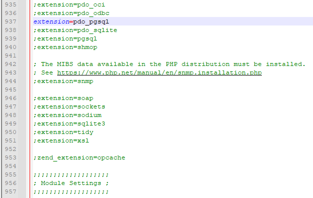

# Установка и настройка ПО

## Оглавление

1. [Создание иерархии каталогов веб-приложения](#создание-иерархии-каталогов-веб-приложения)

2. [Установка Notepad++](#установка-notepad)

3. [Установка Chrome](#установка-chrome)

4. [Установка и настройка Apache](#установка-и-настройка-apache)

5. [Установка, настройка PHP и Xdebug](#установка-настройка-php-и-xdebug)

6. [Установка и настройка Visual Studio Code](#установка-и-настройка-visual-studio-code)

7. [Установка и настройка Git](#установка-и-настройка-git)

8. [Установка и настройка PostgreSQL](#установка-и-настройка-postgresql)

9. [Установка pgAdmin](#установка-pgadmin)

# Создание иерархии каталогов веб-приложения

1. На диске `C` создадим каталог `web` с подкаталогами `apache`, `application`,
`logs`, `php`. Каталог `apache` будет содержать в себе файлы веб-сервера Apache. 
В каталоге `application` будут храниться файлы нашего веб-приложения. В `logs` 
будут содержаться файлы с логами веб-сервера. Каталог `php` предназначен для 
файлов скриптового языка PHP.

    

2. В каталоге `logs` создадим два файла `apache-access.log` и 
`apache-error.log`.

3. В каталоге `application` создадим файлы `index.html` и `index.php`. Откроем
файл `index.html` и добавим строку `It works!`. Откроем другой файл `index.php` 
и добавим строку `<?php phpinfo(); ?>`. Сохраним и закроем файлы.

# Установка Notepad++

1. Переходим на [страницу загрузки Notepad++](https://notepad-plus-plus.org/downloads/)
и скачиваем последнюю версию.

2. Запускаем установочный файл. Все настройки оставляем по умолчанию. 
Устанавливаем.

# Установка Chrome

1. Переходим на [страницу загрузки Google Chrome](https://www.google.com/intl/ru/chrome/)
и скачиваем установочный файл.

2. Запускаем установочный файл. Никаких настроек выполнять не нужно.

# Установка и настройка Apache

1. Для установки веб-сервера Apache, перейдем на страницу 
[Apache Lounge](https://www.apachelounge.com/download/) с последней доступной бинарной сборкой для Windows `Apache 2.4.57 Win64`

2. На странице Apache Lounge указано, что перед установкой веб-сервера Apache 
необходимо убедиться в том, что на локальной машине имеется пакет библиотек 
Microsoft Visual C++ Redistributable для компилятора MSVC от Microsoft. Для 
версии веб-сервера Apache 2.4.52 необходим пакет библиотек Microsoft Visual C++ 
2015-2022 Redistributable 14.31.31103.0.

3. Откроем список программ Windows: `Панель управления > Программы > Программы и 
компоненты`. Если в списке отсутствует пакет библиотек Microsoft Visual C++ 
2015-2022 Redistributable требуемой версии, то скачиваем и устанавливаем данные
библиотеки. Ссылки на пакет библиотек для соответствующей разрядности 
операционной системы: [x64](https://aka.ms/vs/17/release/VC_redist.x64.exe) и 
[x86](https://aka.ms/vs/17/release/VC_redist.x86.exe).

4. Загрузим со страницы Apache Lounge zip-архив с файлами веб-сервера Apache 
соответствующей разрядности операционной системы.

5. Распакуем zip-архив в какой-либо каталог и перейдем в данный каталог. В 
каталоге будет находиться каталог `Apache24`, в котором содержатся все файлы
веб-сервера Apache.

6. Скопируем все файлы из каталога `Apache24` в каталог `C:\web\apache`.

7. Открываем основной файл конфигурации веб-сервера Apache 
`C:\web\apache\conf\httpd.conf` в текстовом редакторе.

8. Находим строку `Define SRVROOT`. В данной строке задается абсолютный путь до 
каталога, содержащего файлы веб-сервера. В нашем случае таким каталогом является 
`C:\web\apache`. Необходимо обратить внимание, что путь должен содержать прямые 
слэши `/`, а не обратные `\`. При необходимости производим замену слэшей в пути.

    

9. Далее необходимо настроить порт, который будет прослушивать веб-сервер 
Apache. Для этого найдем строку `Listen 80`. По умолчанию веб-серверы используют
80 порт для работы по протоколу HTTP. Оставим порт неизменным.

    

10. Укажем веб-серверу Apache, где находится корневой каталог нашего 
веб-приложения. Для этого найдем строки `DocumentRoot "${SRVROOT}/htdocs"` и
`<Directory "${SRVROOT}/htdocs">`. В данный строках укажем путь `c:/web/application`.
Результат представлен на скриншоте:

    

11. Произведем настройку логирования. Найдем строки `ErrorLog` и `CustomLog`
и укажем в данных строках пути до файлов логирования:

    

12. Сохраняем файл `httpd.conf` с конфигурацией веб-сервера Apache.

13. Запускаем командную строку от имени администратора.

    

14. В командной строке выполняем команду перехода в директорию `bin` 
веб-сервера Apache:

        cd C:\web\apache\bin

15. Зарегистрируем службу веб-сервера Apache в Windows. Для этого в командной
строке введем команду:

        httpd.exe -k install

16. После введения команды возникнет предупреждение брандмауэра Windows.
Необходимо нажать на кнопку "Разрешить доступ".

    

17. В командной строке должно появиться сообщение об успешной установке Apache
следующего вида:

    

18. На рабочем столе создадим ярлык для файла `ApacheMonitor.exe`. Путь до файла:

        C:\web\apache\bin\ApacheMonitor.exe

19. Запустим ApacheMonitor, кликнув на ярлык. В системном трее на панели задач
появится иконка ApacheMonitor. Кликнем на данную иконку ЛКМ и нажмем на кнопку
`Start` (Apache2.4 > Start). Данным действием, мы запустили веб-сервер Apache.

20. Проверим работоспособность веб-сервера Apache. Для этого откроем браузер и
введем в адресную строку
        
        http://localhost/ 

    В браузере должна появиться html-страница с текстом `Index of/`. Если
    сообщение появилось, то настройка веб-сервера выполнена правильно.

    

# Установка, настройка PHP и Xdebug

1. Переходим на сайт `https://windows.php.net/download/` и скачиваем zip-архив 
`PHP 8.2 (8.2.10)` версии `VS16 x64 Thread Safe (2023-Aug-29 22:33:56)` под соответствующую разрядность операционной системы.

2. Извлекаем содержимое zip-архива в каталог `C:\web\php`.

3. Скачаем dll-библиотеку дебаггера [Xdebug](https://xdebug.org/download) для
соответствующей версии PHP (в нашем случае `PHP 8.2 VS16 TS (64 bit)`). После скачивания
dll-файл необходимо поместить в каталог `C:\web\php\ext`.

4. В каталоге `C:\web\php` сделаем копию файла `php.ini-development` с именем
`php.ini`.

5. В текстовом редакторе откроем файл `php.ini`. Найдем строку 
`extension=pdo_pgsql` и раскомментируем, убрав точку с запятой.

    
Ищем строку `extension_dir = "ext"`
и ставим абсолютный путь до папки с расширениями
`extension_dir = "C:/web/php/ext/"`
    

6. Находим строку `zend_extension=opcache`. После данной строки вставляем 
следующие строки: 

        zend_extension = C:\web\php\ext\php_xdebug-3.1.3-8.1-vs16-x86_64.dll
        xdebug.mode = debug
        xdebug.start_with_request = yes
        xdebug.client_host = localhost
        xdebug.client_port = 9000
    
    Отметим, что в строке `zend_extension` должен быть указан актуальный путь
    до dll-библиотеки из 3-го пункта.

7. Сохраняем файл конфигурации `php.ini`.

8. Открываем файл конфигурации веб-сервера Apache 
`C:\web\apache\conf\httpd.conf`. И находим конец списка директив `LoadModule`. 
В конец списка директив добавляем следующие строки:

        LoadModule php_module "C:/web/php/php8apache2_4.dll"
        PHPIniDir "C:/web/php"

    

9. Находим строку `IfModule mime_module` и перед закрывающим тэгом `IfModule`
добавляем строку

        AddType application/x-httpd-php .php

10. Сохраняем файл конфигурации `httpd.conf`.

11. Перезапускаем веб-сервер Apache. Для этого в трее ЛКМ кликаем на иконку 
ApacheMonitor и нажимаем кнопку `Restart`.
    
    В папке `C:\web\application` создаем файл `index.php`.
    Открываем на редактирование, вставляем строки:
    
        <?php
            phpinfo();
        ?>

12. Откроем браузер и введем в адресную строку

        http://localhost/index.php

    Должна появиться страница с информацией о PHP следующего вида:

    

13. Добавляем в переменные окружения PHP и APACHE
`Панель управления\Система и безопасность\Система`, Дополнительные параметры системы, Переменные среды, Системные переменные, Path, Изменить

Добавляем:
* C:\web\php
* C:\web\apache\bin

 **Перезагружаем компьютер!**

# Установка и настройка Visual Studio Code

1. Переходим на сайт IDE [Visual Studio Code](https://code.visualstudio.com/) и
нажимаем кнопку `Download for Windows`.

2. После скачивания установочного файла запускаем его. Принимаем условия 
лицензионного соглашения. Нажимаем кнопку "Далее" столько раз, сколько 
необходимо. При этом все значения параметров оставляем по умолчанию. После этого
нажимаем `Установить`.

3. Откроем Visual Studio Code и настроим автосохранение файлов.

    

4. Откроем наш каталог с веб-приложением в Visual Studio Code. Для этого 
перейдем в проводник при помощи сочетания клавиш `ctrl + shift + e` и нажнем
на кнопку `Open Folder`.

    

5. В открывшемся окне выбираем каталог `C:\web\application`

    

6. После выбора каталога в Visual Studio появится всплывающее окно, в котором
необходимо дать разрешение на использование каталога application, нажав на
кнопку `Yes, I trust the authors`.

    

7. Структура проекта примет следующий вид:

    

8. Установим плагин `PHP Intelephense` для расширенной поддержки синтаксиса PHP
в Visual Studio Code. Для этого перейдем в магазин расширений при помощи 
сочетания клавиш `ctrl + shift + x` и в строку поиска введем `PHP Intelephense`.
Затем нажмем на кнопку `Install`.

    

9. Установим плагин `PHP Debug`. В строке поиска расширений введем `PHP Debug` и
нажмем на кнопку `Install`.

    

10. Настроим плагин `PHP Debug`. Перейдем на вкладку дебага при помощи сочетания
клавиш `ctrl + shift + d` и нажмем на ссылку `create launch.json file`.

    

11. Появится окно, в котором необходимо выбрать в качестве окружения `PHP`

    

12. После выбора окружения откроется файл `launch.json`, в котором необходимо
поменять порт с `9003` на `9000`.

    

    После редактирования сохраняем файл.

13. Нажимаем на кнопку `Listen for Xdebug` в разделе отладки

    

    При первом нажатии появится окно брандмауэра, в котором необходимо разрешить
    нажать на кнопку `Разрешить доступ`.

    

14. Перейдем в проводник проекта, используя сочетание клавиш `ctrl + shift + e`, и 
откроем файл `index.php`. В первой строке файла `index.php` поставим точку 
останова, нажав немного левее номера строки.

    

15. Откроем браузер и в адресной строке перейдем по адресу

        http://localhost/index.php

16. В панели задач начнет мигать иконка Visual Studio Code. Откроем ее.

    

    Остановим процесс отладки, нажав на кнопку `Stop`.

    

# Установка и настройка Git

1. Скачаем и запускаем установочный файл с сайта 
[Git SCM](https://git-scm.com/downloads).

2. В окне с лицензией нажимаем `Next`.

    

3. В окне выбора установочного каталога оставляем все по умолчанию, нажимаем 
`Next`.

    

4. В окне выбора компонентов оставляем все по умолчанию, нажимаем 
`Next`.

    

5. В окне задания названия для стартового меню оставляем все по умолчанию, 
нажимаем `Next`.

    

6. В окне выбора текстового редактора переключаемся на использование Notepad++,
нажимаем `Next`.

    

7. В окне выбора наименования стартовой ветки оставляем все по умолчанию, 
нажимаем `Next`.

    

8. В окне настройки переменной окружения PATH оставляем все по умолчанию, 
нажимаем `Next`.

    

9. В окне настройки SSH оставляем все по умолчанию, нажимаем `Next`.

    

10. В окне выбора библиотеки SSH оставляем все по умолчанию, нажимаем `Next`.

    

11. В окне выбора окончания текстовых файлов оставляем все по умолчанию, 
нажимаем `Next`.

    

12. В окне выбора эмулятора в git bash оставляем все по умолчанию, 
нажимаем `Next`.

    

13. В окне настройки git pull оставляем все по умолчанию, 
нажимаем `Next`.

    

14. В окне настройки Git Credential Helper выбираем `None`, нажимаем `Next`.

    

15. В окне настройки дополнительных опций оставляем все по умолчанию, 
нажимаем `Next`.

    

16. В окне настройки экспериментальных опций оставляем все по умолчанию, 
нажимаем `Install`.

    

# Установка и настройка PostgreSQL

1. Переходим на сайт [postgrespro](https://postgrespro.ru/windows) и скачиваем 
установочный файл версии 14.1.

2. Запускаем установочный файл и выбираем язык установщика

    

3. В окне приветствия нажимаем на кнопку `Далее`

    

4. В окне лицензионного соглашения нажимаем на кнопку `Принимаю`

    

5. В окне выбора компонентов оставляем все по умолчанию, нажимаем `Далее`

    

6. В окне выбора установочного каталога оставляем все по умолчанию, 
нажимаем `Далее`

    

7. В окне выбора каталога баз данных оставляем все по умолчанию, 
нажимаем `Далее`

    

8. В окне настройки параметров сервера задаем пароль для суперпользователя 
postgres. В качестве пароля выберем слово `1`, чтобы не забыть. Также 
установим галочку `Настроить переменные среды`.

    

9. В окне оптимизации параметров оставляем все по умолчанию, нажимаем `Далее`

    

10. В окне настройки стартового меню оставляем все по умолчанию, 
нажимаем `Установить`

    

# Установка pgAdmin

1. Переходим на страницу [pgAdmin](https://www.pgadmin.org/download/) и 
скачиваем установочный файл.

2. Запускаем установочный файл. Выбираем `Install for all users`.

    

3. В окне приветствия нажимаем на кнопку `Next`

    

4. В окне лицензионного соглашения ставим радиокнопку в положение
 `I accept the agreement` и нажимаем на кнопку `Next`

    

5. В окне выбора установочного каталога оставляем все по умолчанию, 
нажимаем `Next`

    

6. В окне настройки стартового меню оставляем все по умолчанию, 
нажимаем `Next`

    

7. В окне просмотра пунктов установки нажимаем кнопку `Установить`

    

8. Запустим pgAdmin и установим пароль. В качестве пароля выберем слово `1`.

    

9. Настроим язык интерфейса pgAdmin. Для этого перейдем в пункт 
`File > Preferences`.

    

    В пункте `User language` выберем `Russian` и нажмем `Save`.

    

10. Перезапустим pgAdmin для обновления интерфейса.

    
